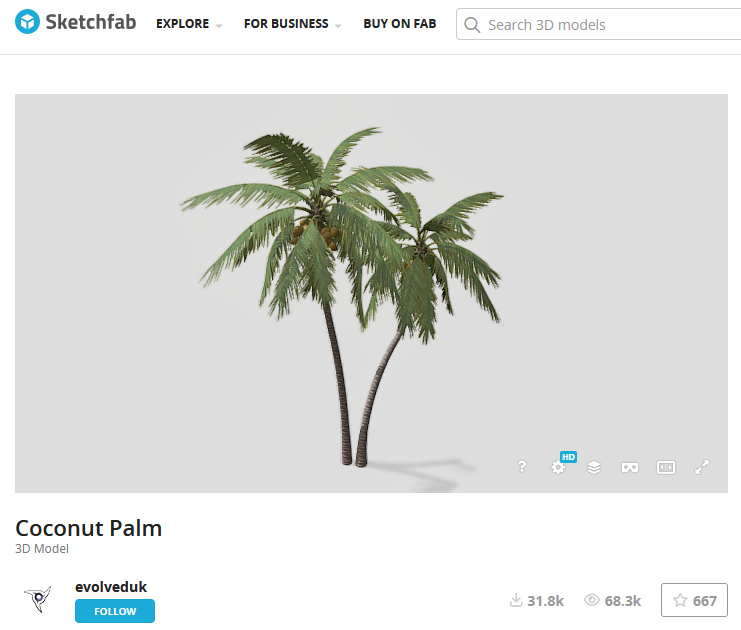
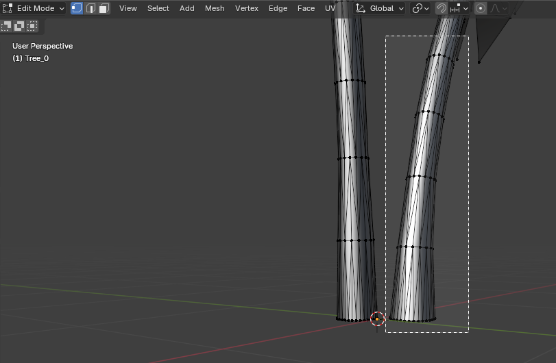
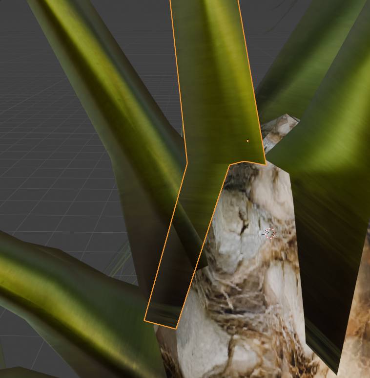
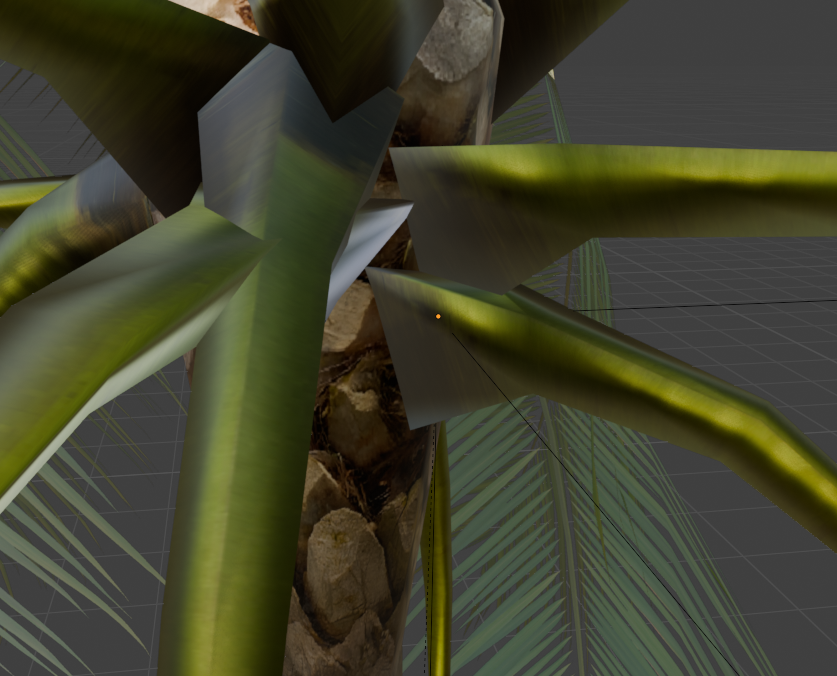

# Coconut Palm Blender Guide

Download the model from **Sketchfab**:  
[Coconut Palm](https://sketchfab.com/3d-models/coconut-palm-26e787f2ff2e4c0fb004c3b0210805a3)



---

## 1. Import the Palm Tree Model

- Import the palm tree `.fbx` file into Blender.
- To ensure textures work correctly, organize files like this:

```text
coconut_palm/
├── textures/
│   ├── texture_1.png
│   ├── texture_2.png
│   └── ...
├── model.fbx
└── project.blend
```

- After importing, the structure may look like:

```text
Tree_0 (trunk)
└── Tree_1 (trunk_top)
    └── Tree_2 (leaf)
        └── Tree_3 (leaf_base)
            └── Tree_4 (coconut)
```

- Separate all parts:
  - Go to: **Object → Parent → Clear and Keep Transformation**

- Final separated parts:

  - `Tree_0` (trunk)
  - `Tree_1` (trunk_top)
  - `Tree_2` (leaf)
  - `Tree_3` (leaf_base)
  - `Tree_4` (coconut)

---

## 2. Delete One of the Trees

If there are multiple trees:

1. Go to **Edit Mode**
2. Select one tree
3. Press **Delete**
4. Repeat until only one tree remains



---

## 3. Organize

### Combine trunk parts

- Select:
  - `trunk`
  - `trunk_top`
- Use: **Object → Join**

### Combine leaf parts

- Select:
  - `leaf`
  - `leaf_base`
  - `coconut` *(optional)*  
- Use: **Object → Join**

### Final structure

- `Combined_trunk`
- `Combined_leaf`

---

## 4. Separate Leaf Parts

1. Select `Combined_leaf`
2. Go to **Edit Mode**
3. Use: **Mesh → Separate → By Loose Parts**

This creates:

```text
Combined_leaf_001
Combined_leaf_002
...
Combined_leaf_xxx
```

- Combine each **leaf + leaf_base pair**

---

## 5. Fix Leaf Penetration (Boolean)

For each leaf cluster:

1. Select the object
2. Add Modifier → **Boolean**
3. Settings:

   - Operation: `Difference`
   - Object: `trunk`
   - Solver: `Exact`

4. Apply modifier
5. Repeat for all leaf parts

Result: leaves no longer intersect with trunk



> **Note**  
> Sometimes Boolean creates unwanted trunk geometry.  
> If this happens:
> - Delete that leaf
> - Copy another leaf
> - Move and replace it manually

---

## 6. Rigid Body Setup

### Trunk

- Add **Rigid Body**
- Set:
  - Type = `Passive`

### Leaf Clusters

- Add **Rigid Body**
- Set:
  - Type = `Active`

---

## 7. Add Hinge-Like Constraint

1. Place Empty:
   - `Shift + Right Click`
   - **Add → Empty → Plain Axes**

2. Position it between:
   - trunk
   - leaf base

3. Add **Rigid Body Constraint**

4. Settings:

   - Type: Generic Spring
   - Enable: XYZ Angular


Adjust:

- Angular limits (degrees)
- Stiffness
- Damping



---

## Notes
- `Generic Spring` allows leaves to bend and return.
- Increase stiffness → faster return.
- Increase damping → smoother motion.


